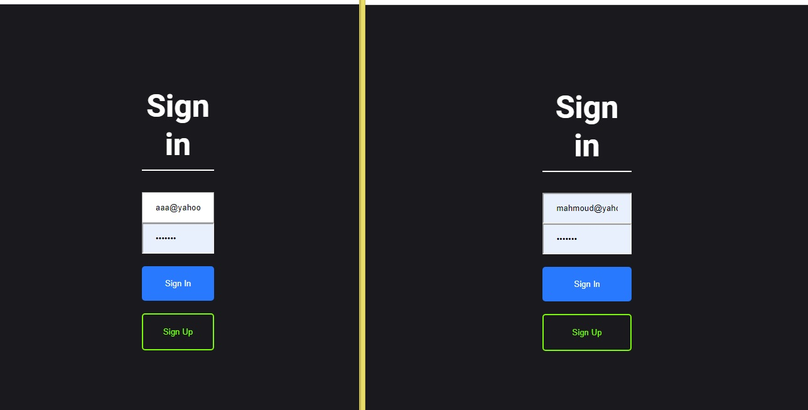
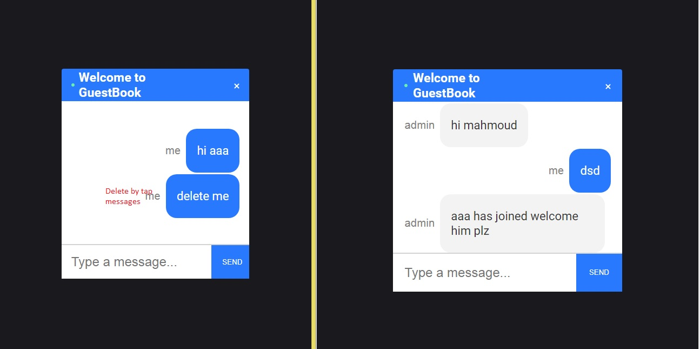
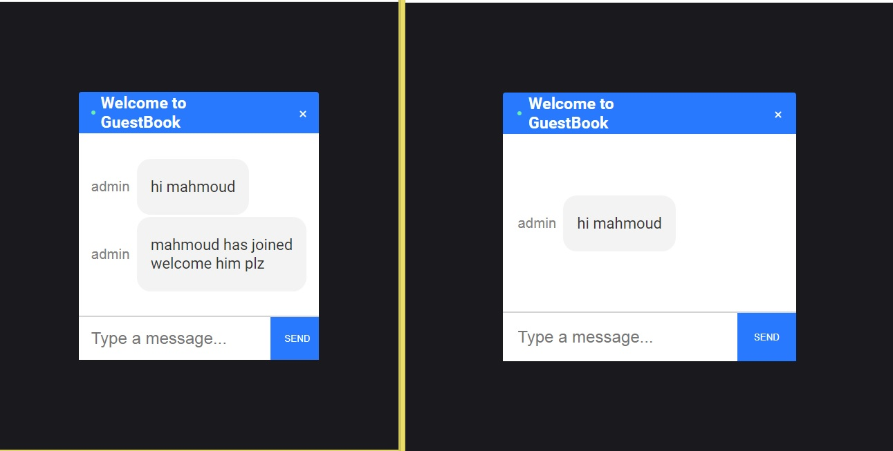

#GuestBook

## Table of contents
* [General info](#general-info)
* [Technologies](#technologies)
* [Setup](#setup)

## General info
This project is public channel massaging app  users can create account  and  send , replay , delete
messages on the public room  .
	
## Technologies
Project is created with:
* Nodejs
* socket.io
* MongoDB
* Express
* react.js
	
## Setup
To run this project, install it locally using npm:
and run separately both Projects
#### back-end server 
```
$ cd server
$ npm install
$ npm run dev
```

#### back-end server 
```
$ cd view
$ npm install
$ npm start
```
## Screenshoots


